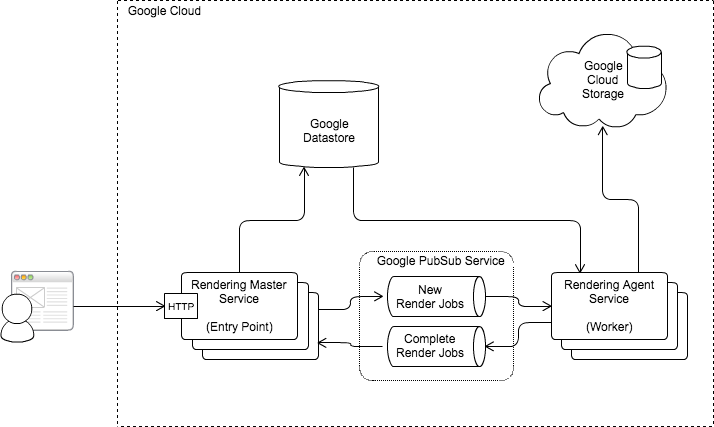

# code-tv
Code TV is short 3-day long hackathon project with goal to create a cloud service 
for generating [Gource][gource] video presentations from any public GitHub source code repository.
The resulting video captures history of the development by analyzing and visualizing commit activities
in the repository.
   
The service consist of two [dockerized][docker] Node.js microservice applications deployed to 
Google Container Cloud using Kubernetes:
- _Rendering Master_ - a simple front-end endpoint providing HTML facade for the service
- _Rendering Agent_ - a worker service that performs the actual logging
 
The deployment architecture is described in the following diagram: 

The Rendering Master receives rendering requests from clients and stores them in a Google Cloud Datastore. 
Then it sends a notification to the Rendering Agent using Google PubSub service. Once the notification is 
received by one of the Rendering Agents, the Agent retrieves additional data from the Google Cloud Datastore,
clones the git repository and starts the rendering of the movie. When the movie rendering is complete, 
the Agent uploads the result to the Google Cloud Storage and sends a notifcation via PubSub service back to the
Master. This notification is from Master propagated further to the client browser via a WebSocket message.
 
Once the final WebSocket event is received by the browser including the link to the movie stored in one of the 
service's Google Cloud Storage bucket and the movie is ready for watching.

[docker]: https://www.docker.com
[gource]: https://code.google.com/p/gource
